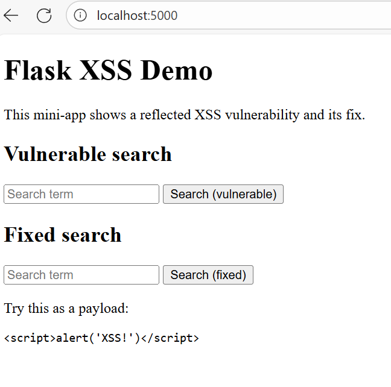

# Flask Reflected XSS Demo

This demo shows how a small template change can introduce a reflected XSS vulnerability.

## Running locally

```bash
python -m venv .venv
source .venv/bin/activate  # Windows: .venv\Scripts\activate
pip install -r requirements.txt
python app.py
```

Then try something like this as a payload in the search forms:

&lt;script&gt;alert('XSS!')&lt;/script&gt;

Or navigate to these:

Vulnerable: http://localhost:5000/search-vuln?q=%3Cscript%3Ealert('XSS!')%3C%2Fscript%3E

Fixed: http://localhost:5000/search-fixed?q=%3Cscript%3Ealert('XSS!')%3C%2Fscript%3E

## UI Preview

<details>
  <summary>Click to expand screenshot</summary>

  

</details>
