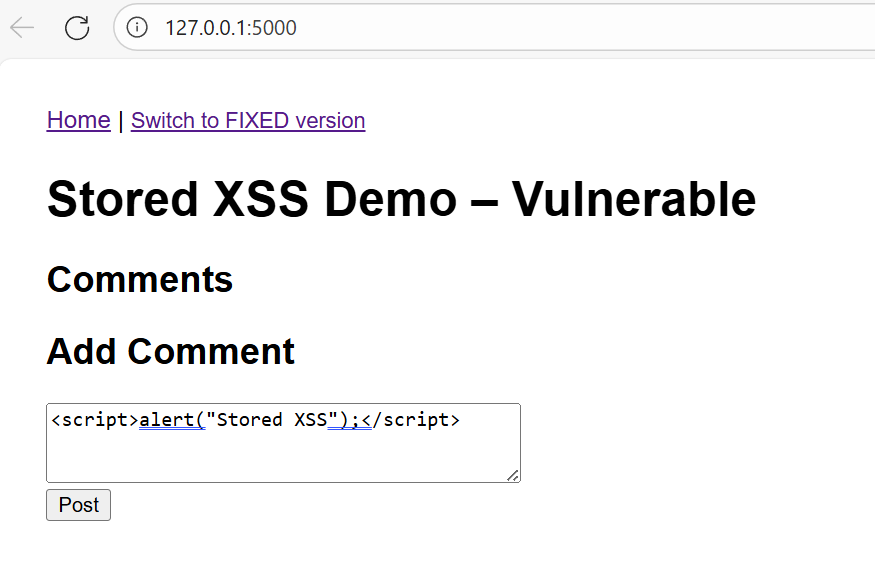

# Flask Stored XSS Demo

This demo shows how **Stored (Persistent) Cross-Site Scripting (XSS)** works
and how to fix it.

## Vulnerable Version
- User comments are stored and rendered without escaping.
- Any script injected by one user executes for all future visitors.

## Fixed Version
- User input is safely escaped by Jinja2.
- No dangerous HTML or JavaScript executes.

## Running
pip install -r requirements.txt
python app.py

Visit:
- http://localhost:5000/?mode=vuln
- http://localhost:5000/?mode=fixed

## Example Payload

## UI Preview

  
Click to expand screenshot

  

